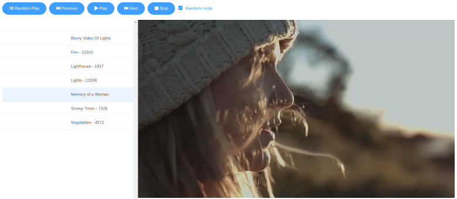

# Web Media Jukebox

Media jukebox powered by Vue.js



## Setup

Copy media files into `public/media/` folder.

Then create `public/items.json` file in following format.

```json
[
  {
    "title": "Blurry Video Of Lights",
    "album": "",
    "url": "/media/Blurry%20Video%20Of%20Lights.mp4"
  },
  {
    "title": "Fire - 12910",
    "album": "",
    "url": "/media/Fire%20-%2012910.mp4"
  },
  /* ... */
]
```

## Execute

```
npm install
npm run serve
```

Then open http://server:8080/.

